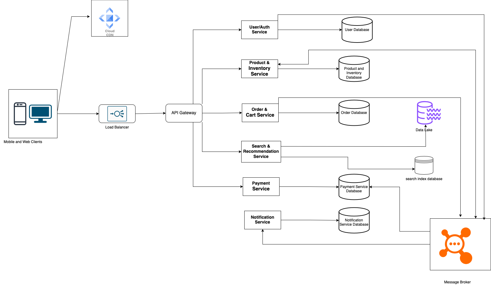

## System Design Task

### High-Level Architecture Diagram

Below is the high level architecture digram for an e-commerce platform that will handle high traffic and scale easily.

### Database Design

- User/Auth Service Service Database
    - users
        - id
        - email
        - phone
        - hashed_password
        - status
    - addresses
        - id
        - user_id
        - street
        - city
        - state
        - country
    - auth_session
        - id
        - issued_time
        - expiry_time
        - user_id
        - token_type
        - ip
    - blocked_auth
        - id
        - auth_session_id
- Product and inventory Service Database
    - product
        - id
        - name
        - description
        - price
        - identification
        - price
        - brand_id
        - category_id
    - categories
        - id
        - name
    - brands
        - id
        - name
    - warehouses
        - id
        - name
        - location_id
    - inventory
        - id
        - product_id
        - warehouse_id
        - quantity
-  Order & Cart Service Database
    - cart
        - id
        - user_id
    - cart_items
        - id
        - cart_id
        - product_id
        - quantity
    - orders
        - id
        - user_id
        - address_id
        - order_status
        - payment_status
    - order_items
        - id
        - order_id
        - product_id
        - quantity
-  Payment Service
    - payment
        - id
        - order_id
        - user_id
        - amount
        - status
        - reference_id
        - payment_method
        - authorization_code
        - response_code
        - response_message
        - token_id
    - payment_logs
        - id
        - payment_id
        - log_message
    - tokens
        - id
        - value
        - expiry
        - payment_method
        - user_id

### SQL vs NoSQL choice
Choosing a database storage engine depends on the use case and the specific domain problem at hand.

SQL databases support 
- Data consistency
- Complex queries and relationships
- Transactional integrity

NoSql Database supports
- High Scalability and distributed architecture
- Schema Flexibility
- Fast read and write operations

The payment service database, order & cart service database, inventory database, user service database should use SQL based storage engines.

The notification service can use a NoSql database.

The Search and Recommendation service should connect to a search index database that supports scalable full-text search and a data lake capable of processing user recommendations.

### Scaling Strategy

To scale our e-commerce application effectively, we should focus on infrastructure scaling, database scaling, and optimization of application.

- **Infrastructure scaling**: Ensure that our e-commerce application is deployed across servers distributed across several availability zones and that requests are properly load-balanced across all services. A global load balancer can be used so the DNS service can use latency-based routing to find the load balancer server that best fits the user's request. Lastly, services can be autoscaled depending on infrastructure metrics like CPU and Memory usage.

- **Database scaling**: As read and write operations increase, it's important to properly optimize the database layer. The first point of call will be to properly index our database and properly optimize the queries. The database can also be sharded or partitioned depending on the use case

- **Application optimization**: Our application layer can be broken down from a monolith into a microservice, this will make it easier to scale horizontally. Regularly accessed data can be stored in a cache to reduce the frequency of database access and static contents like images e.t.c should be hosted on CDNs as this will reduce latency. Application design patterns like event-driven architecture should be used so that multiple services can source the same event and process simultaneously.

### Security Considerations
Security Considerations (How would you handle DDoS attacks, API security, data encryption?).

- DDoS attacks: To prevent DDoS attacks we can implement request throttling at the API gateway. Also use a web application firewall and cloud based DDoS Protection services.
- Data Encryption: All web traffic transmission should be encrypted using HTTPS and sensitive data like password should not be stored in plain text. Users payment information like card details should be tokenized and where necessary encrypted.
- API security: User authentication should be stateless and implemented using a secure technique like JWT. The API gateway should be able to identify and validate the user making requests to other services.

